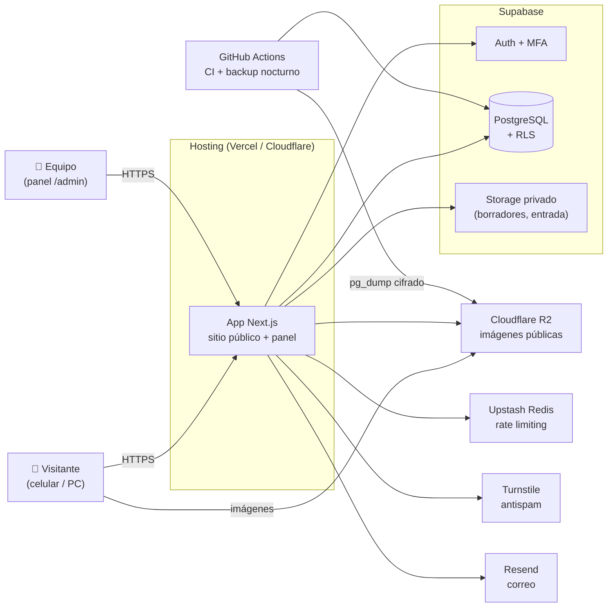
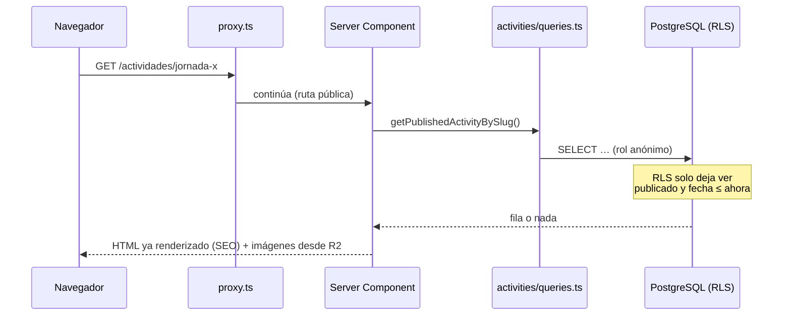
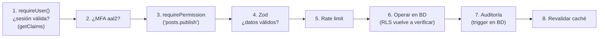
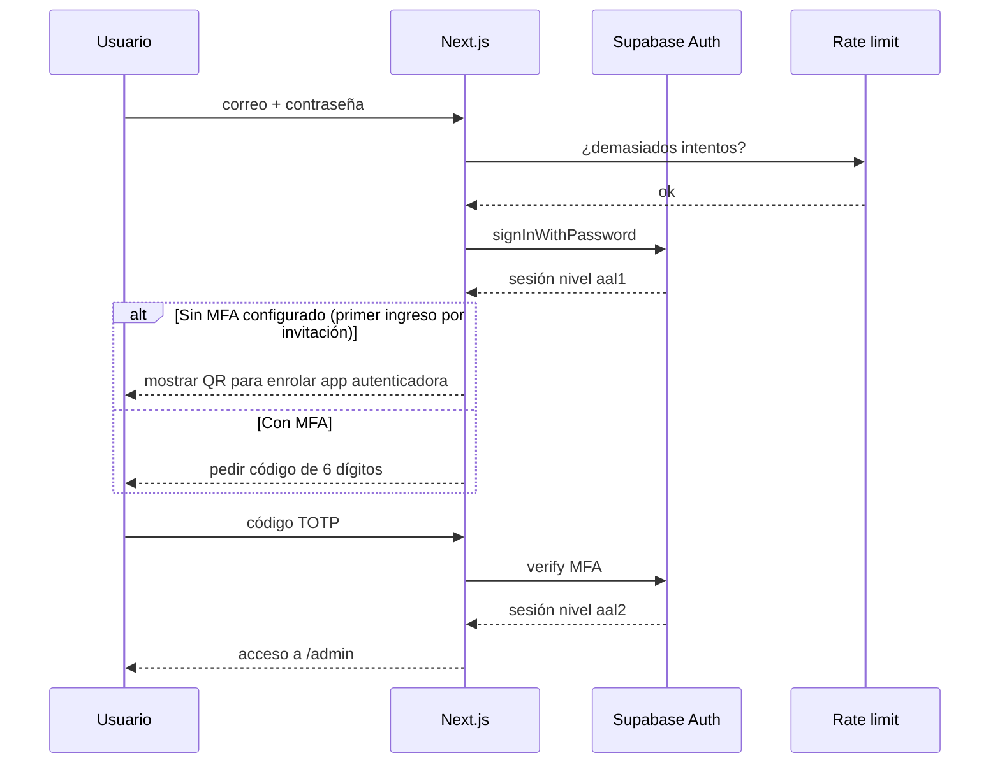
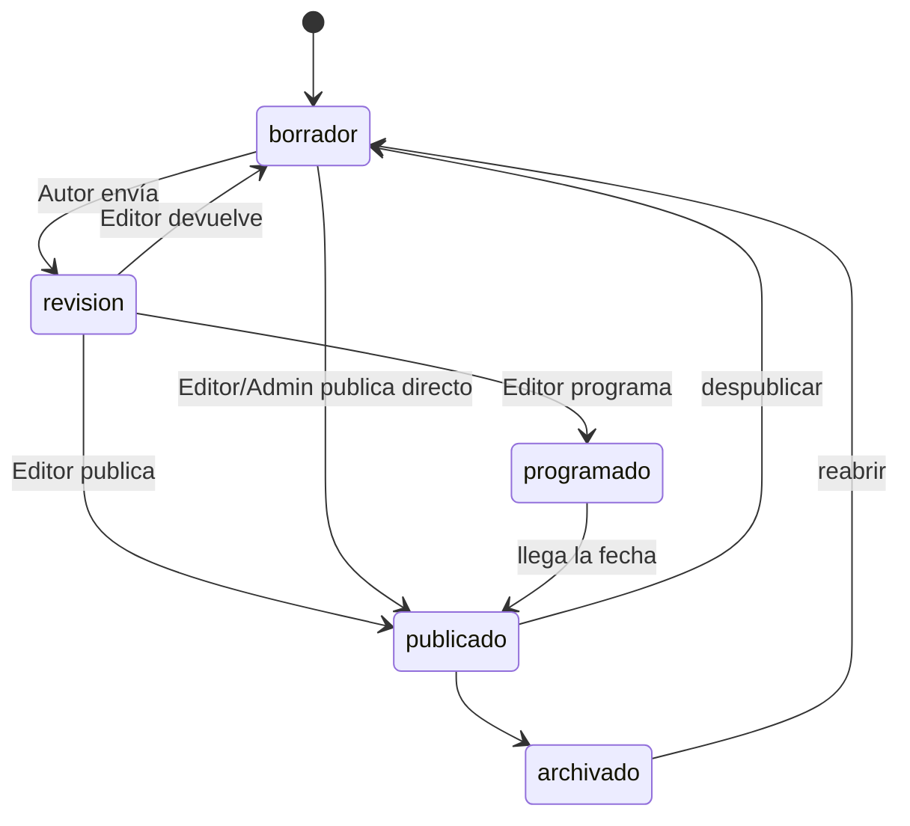

# 04 · Arquitectura

> Versión 0.1 (borrador para aprobación) · 26-sep-2026
> Relacionado: `03-stack-tecnologico.md` · `05-seguridad.md` · `06-modelo-datos.md`

Los diagramas usan **Mermaid**: GitHub los dibuja automáticamente al abrir este archivo.

---

## 1. Vista general



**Cómo leerlo:** el navegador **nunca** habla directo con la base de datos para escribir: todo pasa por la app Next.js, que verifica usuario, MFA y permisos. Las imágenes públicas se sirven desde R2 (rápido y sin costo de transferencia).

## 2. Estilo: monolito modular

**Una sola aplicación** (no microservicios), organizada por **módulos de dominio**.

- *¿Por qué no microservicios?* Para una persona y un sitio de este tamaño serían más despliegues, más costos y más puntos de falla sin ningún beneficio.
- *¿Por qué módulos?* Cada módulo (historias, actividades, medios…) tiene sus validaciones, lecturas y acciones juntas. Si en la Etapa B algo necesita separarse, ya está aislado.

Regla de dependencia: `app/` (rutas) → usa `modules/` → usa `lib/`. **Nunca al revés**, y un módulo no importa archivos internos de otro (solo lo que este exporte en su `index.ts`).

## 3. Estructura de carpetas

```
reconstruyendo-esperanza/
├── src/
│   ├── app/
│   │   ├── (public)/                 # Sitio público (rutas en español)
│   │   │   ├── page.tsx              # Inicio
│   │   │   ├── quienes-somos/
│   │   │   ├── actividades/[slug]/
│   │   │   ├── historias/[slug]/
│   │   │   ├── proyectos/[slug]/
│   │   │   ├── galeria/[slug]/
│   │   │   ├── videos/
│   │   │   ├── memoria/
│   │   │   ├── contacto/
│   │   │   ├── apoyanos/
│   │   │   ├── buscar/
│   │   │   └── legal/[slug]/         # política de datos, aviso de privacidad
│   │   ├── admin/
│   │   │   ├── (auth)/               # login, mfa, recuperar (sin menú del panel)
│   │   │   └── (panel)/              # dashboard, contenido, medios, mensajes,
│   │   │                             # usuarios, configuración, auditoría, papelera
│   │   ├── sitemap.ts · robots.ts
│   │   └── layout.tsx · not-found.tsx · error.tsx
│   ├── modules/                      # Lógica por dominio
│   │   └── <modulo>/                 # posts, activities, projects, galleries, videos,
│   │       ├── schema.ts             #   media, consents, messages, users, settings,
│   │       ├── queries.ts            #   audit, taxonomy, team, testimonials
│   │       ├── actions.ts
│   │       ├── components/
│   │       └── index.ts
│   ├── components/
│   │   ├── ui/                       # shadcn/ui
│   │   └── layout/                   # header, footer, menú, contenedores
│   ├── lib/
│   │   ├── supabase/                 # server.ts · client.ts · admin.ts (server-only)
│   │   ├── auth/                     # require-user.ts · require-permission.ts
│   │   ├── storage/                  # interfaz + implementaciones Supabase / R2
│   │   ├── email/                    # interfaz + implementación Resend
│   │   ├── rate-limit/               # interfaz + implementación Upstash
│   │   ├── images/                   # validación de firma + procesamiento sharp
│   │   └── utils/                    # fechas (America/Bogota), slugs, etc.
│   ├── types/database.ts             # generado por Supabase CLI
│   └── proxy.ts                      # (antes middleware.ts) refresca sesión, protege /admin
├── supabase/
│   ├── migrations/                   # único camino para cambiar el esquema
│   ├── tests/                        # pgTAP (RLS)
│   ├── seed.sql                      # datos [DEMO] para desarrollo local
│   └── config.toml
├── tests/e2e/                        # Playwright
├── .github/workflows/                # ci.yml · backup.yml
├── docs/
├── .env.example                      # nombres de variables, sin valores
└── CLAUDE.md · README.md
```

### Qué va en cada archivo de un módulo

| Archivo | Responsabilidad | ¿Dónde corre? |
|---|---|---|
| `schema.ts` | Esquemas Zod (qué datos son válidos) | Servidor y navegador |
| `queries.ts` | Lecturas de BD. Empieza con `import 'server-only'` | Solo servidor |
| `actions.ts` | Server Actions (crear, editar, publicar…) | Solo servidor |
| `components/` | Componentes de UI del módulo | Según el componente |
| `index.ts` | Lo que el módulo expone a los demás | — |

## 4. Cómo viaja una petición

### 4.1 Lectura pública (ej. abrir una actividad)



La respuesta se **guarda en caché** y se regenera cuando alguien publica o edita (revalidación por etiquetas) o cada pocos minutos. Así el sitio es rápido y la BD recibe pocas consultas.

### 4.2 Escritura en el panel (ej. publicar)

Toda Server Action sigue **siempre** este orden (definido en `CLAUDE.md`):



Si cualquier paso falla, la acción se detiene y devuelve un error claro (sin detalles internos). La **RLS en el paso 6 es la segunda barrera**: aunque hubiera un error en el código, la BD rechaza lo no permitido.

## 5. Flujos clave

### 5.1 Inicio de sesión con MFA



`proxy.ts` y cada Server Action exigen **aal2**: con solo la contraseña no se ve nada del panel.

### 5.2 Ciclo de vida del contenido



**Publicación programada sin tareas programadas:** "programado" guarda `published_at` en el futuro. Las consultas públicas (y la RLS) muestran contenido con `published_at ≤ ahora`, así que aparece solo. La caché de listados se regenera cada pocos minutos, por lo que puede tardar hasta ~5 min en verse — aceptable para este sitio y evita depender de un cron.

### 5.3 Subida de imágenes

Problema a resolver: las fotos de celular pesan 3–8 MB, traen **GPS en los metadatos**, y los servidores sin estado limitan el tamaño de lo que reciben (~4,5 MB en Vercel).

```mermaid
sequenceDiagram
    participant C as Celular (navegador)
    participant App as Server Action
    participant In as Storage privado<br/>(bucket de entrada)
    participant Pr as Storage privado<br/>(procesadas)
    participant R2 as R2 (público)

    C->>C: aplica la rotación, reduce a 2560px y convierte a JPEG<br/>(ahorra datos 4G; convierte HEIC)
    C->>App: pedir URL de subida firmada
    App-->>C: URL válida 60 s, nombre UUID
    C->>In: sube el archivo directo
    C->>App: "listo, procesa"
    App->>In: descarga
    App->>App: valida firma binaria (JPEG/PNG/WebP), tamaño y píxeles<br/>sharp: re-codifica a WebP en 3 anchos (480, 1080, 1920) → sin EXIF/GPS
    App->>Pr: guarda versiones procesadas
    App->>In: borra el original
    Note over App,R2: Al PUBLICAR el contenido<br/>(y si la foto tiene autorización cuando la requiere)
    App->>R2: copia versiones públicas
    Note over App,R2: Al despublicar, borrar o revocar autorización<br/>se eliminan de R2
```

- El **original con GPS nunca se conserva**.
- Mientras el contenido es borrador, sus fotos **no son públicas** (solo el panel las ve con URL firmada temporal).
- Solo WebP (AVIF es más lento de codificar en servidores sin estado). Con 3 tamaños son ~550 KB por foto: el 1 GB del Storage gratuito alcanza para **~1.800 fotos** procesadas; si se acerca, se reduce a una sola versión privada (la pública vive en R2, F7).
- Fotos que quedan a medias (se cerró la app durante la subida): la pantalla **Medios** ofrece *Reintentar* o *Quitar*; la limpieza programada de esos restos llega en la F9.

## 6. Proveedores detrás de interfaces

Para cumplir la portabilidad (RNF-A-09), el código de los módulos **no llama directo** a R2, Resend o Upstash, sino a una interfaz propia:

```ts
// src/lib/storage/types.ts (ilustrativo)
export interface PublicStorage {
  put(key: string, data: Buffer, contentType: string): Promise<string>; // devuelve URL
  remove(key: string): Promise<void>;
}
```

Cambiar de proveedor = escribir otra implementación de la interfaz, sin tocar los módulos. Igual para `EmailSender` y `RateLimiter`.

## 7. Estrategia de renderizado y caché

| Tipo de página | Estrategia | Por qué |
|---|---|---|
| Público (inicio, listados, detalle) | Render en servidor **con caché** + revalidación por etiqueta al publicar/editar + tiempo máximo (~5 min) | Rápido, bueno para SEO, pocas consultas |
| Búsqueda | Dinámica (sin caché) | Depende de lo que escribe el usuario |
| Panel `/admin` | Dinámico, nunca en caché compartida | Datos privados y siempre actuales |
| Imágenes | R2 con caché larga (nombre UUID inmutable) | Si la imagen cambia, cambia el nombre |

> Next.js 16 cambió las APIs de caché. Antes de implementar se consulta la documentación versionada instalada en `node_modules` (regla del `CLAUDE.md`).

## 8. Ambientes

| Ambiente | App | Base de datos | Datos | Quién accede |
|---|---|---|---|---|
| **Local** | `npm run dev` | `supabase start` (Docker) | `seed.sql` con marcadores `[DEMO]` | Victor |
| **Staging** | Vercel Preview (cada PR) + rama `develop` | Proyecto Supabase `reconstruyendo-esperanza-staging` (`us-east-1`) | `[DEMO]` + pruebas | Victor, revisores |
| **Producción** | Vercel/Cloudflare (rama `main`) | Proyecto Supabase de producción (se crea en F10) | Reales | Público + equipo |

- Las migraciones se prueban en local → se aplican en staging → **con aprobación de Victor** se aplican en producción.
- Staging **nunca** tiene datos reales ni copias de producción.

### 8.1 Configuración de staging (creado el 26-sep-2026)

| Servicio | Configuración |
|---|---|
| **Supabase** | Organización *Reconstruyendo Esperanza* (cuenta de la iniciativa como Owner, con MFA; Victor como Developer) · proyecto `reconstruyendo-esperanza-staging` en `us-east-1` · registro público **desactivado** · contraseña mínima 12 · MFA TOTP habilitado |
| Supabase · API | **Data API activada**; **"Automatically expose new tables" desactivado** → ninguna tabla se ve por la API hasta que una migración le dé permisos explícitos (`grant`); **RLS automático activado** en tablas nuevas del esquema `public` |
| **Vercel** | Proyecto `reconstruyendo-esperanza` (cuenta Hobby de Victor) conectado a GitHub · **Vercel Authentication (Standard Protection)**: toda URL de despliegue exige iniciar sesión · **sin dominio de producción**: la dirección `reconstruyendo-esperanza-*.vercel.app` que Vercel crea por defecto se eliminó (26-sep-2026) porque *Standard Protection* **no protege los dominios de producción** y quedaba pública; el dominio real se asigna en F10 · rama de producción `main` · variables `NEXT_PUBLIC_SUPABASE_*` solo en *Preview*, tipo *Config* (públicas por diseño) · la clave secreta se cargará como *Secret* cuando el código la necesite (F5), nunca con prefijo `NEXT_PUBLIC_` |

> **Paridad local ↔ staging:** el Supabase local sí expone las tablas nuevas por defecto y no tiene RLS automático. Por eso cada migración **activa RLS y declara sus `grant` explícitamente**, para comportarse igual en ambos ambientes.

#### Configuración de Auth que hace el *Owner* en el panel de Supabase (staging)

Un *Developer* no puede cambiar Auth (`03` §6). La configuración local vive en `supabase/config.toml`; en staging se replica a mano:

| Dónde (Authentication → …) | Valor | Por qué |
|---|---|---|
| **URL Configuration → Site URL** | `https://reconstruyendo-esperanza-git-develop-victorgutyys-projects.vercel.app/admin/auth/confirm` | Destino por defecto de los enlaces de los correos. Lleva la ruta de confirmación porque una invitación hecha desde el panel de Supabase usa la Site URL como `{{ .RedirectTo }}`; sin la ruta, el enlace caería en la portada (hallado el 26-sep-2026). La app siempre envía su propio destino |
| **URL Configuration → Redirect URLs** | `https://reconstruyendo-esperanza-*-victorgutyys-projects.vercel.app/**` | Solo los despliegues del proyecto pueden recibir enlaces de Auth |
| **Emails → SMTP Settings** | Staging: Gmail de la iniciativa (`smtp.gmail.com`, puerto 465, usuario = el correo, contraseña = *contraseña de aplicación* de Google). Producción (F10): Resend con el dominio verificado | Supabase **solo deja editar las plantillas con SMTP propio**; con su correo por defecto se envían sus plantillas en inglés, cuyo enlace no trae `token_hash` y **no funciona** con `/admin/auth/confirm` |
| **Emails → Reset password** | Asunto y HTML de `supabase/templates/recovery.html` | Enlace con `token_hash` (funciona aunque se abra en otro dispositivo) |
| **Emails → Invite user** | Asunto y HTML de `supabase/templates/invite.html` | Misma técnica, `type=invite` (paso 5.6) |
| **Sign In / Providers → Email** | Proveedor **activado** | Es el método de login; el registro público se cierra con *Allow new users to sign up* (global). Desactivar el proveedor apagaría el login (hallado en 5.5a) |

Vercel (*Preview*): `UPSTASH_REDIS_REST_URL` y `UPSTASH_REDIS_REST_TOKEN` (tipo *Secret*). Sin ellas el login responde "Demasiados intentos" (*fail closed*, `05` §7). **Nunca** `RATE_LIMIT_DRIVER` en Vercel. El origen de los enlaces se toma de `VERCEL_BRANCH_URL` (nunca del encabezado `Host`). `SUPABASE_SECRET_KEY` (tipo *Secret*): la usan invitar y activar/desactivar usuarios, y desde la F6 el acceso a Storage (enlaces firmados de subida y de vista, procesamiento de fotos, formatos de autorización), siempre después de verificar el permiso + MFA en la app. Los buckets no tienen políticas para la API.

#### Primer Administrador de staging (una sola vez)

Nadie puede invitar al primero porque aún no hay Administradores. No hace falta correo:

1. El **Owner** crea la cuenta en el panel de Supabase (*Authentication → Users → Add user → Create new user*, con *Auto Confirm User*). La contraseña (≥ 12) la escribe la propia persona ahí; nunca se comparte.
2. La persona corre en el **SQL Editor** (el MCP de Supabase es de solo lectura) el SQL revisado y aprobado; queda en auditoría como *Cambió el rol* hecho por "Sistema": `update public.profiles set role_id = (select id from public.roles where key = 'admin'), full_name = '<nombre>' where email = '<correo>';`
3. Se verifica con una consulta de solo lectura (rol, estado y las dos entradas de auditoría).
4. La persona entra en `/admin/login`, registra su app autenticadora y, cuando el SMTP esté configurado, invita al resto desde **Usuarios**. Meta: **≥ 2 Administradores** (`05` §4).

Hecho en staging el 26-sep-2026: Victor es el primer Administrador.

En local no hace falta: `npm run db:local-admin` crea un Administrador `[DEMO]` y se niega a correr si Supabase no es el de este equipo.

### Variables de entorno (solo nombres; valores en `.env.local`, jamás en Git)

| Variable | Pública | Uso |
|---|:-:|---|
| `NEXT_PUBLIC_SUPABASE_URL` | Sí | URL del proyecto |
| `NEXT_PUBLIC_SUPABASE_PUBLISHABLE_KEY` | Sí | Clave pública (protegida por RLS) |
| `SUPABASE_SECRET_KEY` | **No** | Solo en `lib/supabase/admin.ts` (`server-only`) |
| `R2_ACCOUNT_ID` · `R2_ACCESS_KEY_ID` · `R2_SECRET_ACCESS_KEY` · `R2_BUCKET` | **No** | Subir/borrar imágenes públicas |
| `NEXT_PUBLIC_MEDIA_BASE_URL` | Sí | Dominio de imágenes públicas |
| `UPSTASH_REDIS_REST_URL` · `UPSTASH_REDIS_REST_TOKEN` | **No** | Rate limiting |
| `NEXT_PUBLIC_TURNSTILE_SITE_KEY` | Sí | Widget antispam |
| `TURNSTILE_SECRET_KEY` | **No** | Verificación en servidor |
| `RESEND_API_KEY` | **No** | Correos |
| `NEXT_PUBLIC_SITE_URL` | Sí | URLs absolutas (SEO, Open Graph) |

## 9. Decisiones de arquitectura (resumen)

| # | Decisión | Alternativa descartada | Motivo |
|---|---|---|---|
| ADR-01 | Monolito modular Next.js | Frontend + API separados | Una persona, un despliegue |
| ADR-02 | Server Actions para escribir | API REST propia | Menos código; validación y permisos en un solo lugar |
| ADR-03 | RLS como segunda barrera | Solo verificar en código | Defensa en profundidad |
| ADR-04 | Contenido en JSON (Tiptap) | Guardar HTML | Evita inyección de código (XSS) |
| ADR-05 | Imágenes: subida directa + procesamiento en servidor + R2 al publicar | Subir a la app / servir desde Supabase | Límite de tamaño, GPS, costo de transferencia |
| ADR-06 | Programación por `published_at` | Cron que cambia estados | Sin piezas extra que puedan fallar |
| ADR-07 | Proveedores detrás de interfaces | Llamadas directas a SDKs | Portabilidad |
