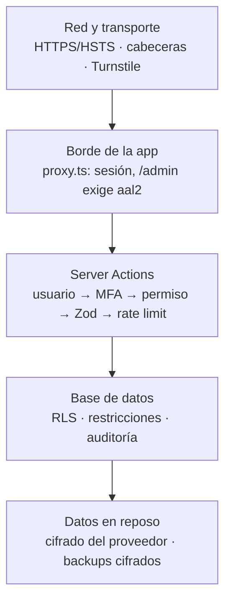

# 05 · Seguridad

> Versión 0.1 (borrador para aprobación) · 26-sep-2026
> Relacionado: `04-arquitectura.md` · `06-modelo-datos.md` · `09-privacidad-y-marco-legal.md`

La seguridad aquí no es una lista de "extras": es la condición para que la organización pueda confiar su memoria y la imagen de la comunidad a esta plataforma.

---

## 1. Principios

1. **Defensa en profundidad**: cada control asume que el anterior puede fallar (interfaz → Server Action → RLS en la BD).
2. **Mínimo privilegio**: cada usuario, clave y proceso tiene solo los permisos que necesita.
3. **Denegar por defecto**: una tabla sin política RLS no devuelve nada; una ruta del panel sin permiso responde "no autorizado".
4. **Minimización de datos**: lo que no se guarda no se puede filtrar.
5. **El repositorio es público**: la seguridad **no** depende de ocultar el código, sino de secretos bien guardados y controles correctos. Todo lo que está en Git se considera visible para cualquiera, para siempre.

## 2. Modelo de amenazas (qué protegemos y de quién)

| Activo | Por qué importa |
|---|---|
| Cuentas del panel | Con una cuenta se puede publicar en nombre de la organización |
| Fotos con personas (sobre todo menores) | Daño a personas reales y riesgo legal |
| Mensajes de contacto | Datos personales de ciudadanos |
| Contenido publicado | Reputación: una alteración (defacement) destruye confianza |
| Claves de servicios | Dan acceso total a BD, almacenamiento o correo |

| Atacante / situación | Ejemplo | Controles principales |
|---|---|---|
| Bots automatizados | Probar contraseñas, spam en contacto | Rate limiting, Turnstile, MFA |
| Oportunista | Buscar claves en repos públicos, dependencias vulnerables | Secretos fuera de Git, escaneo de secretos, Dependabot |
| Adversario motivado (contexto político local) | Intentar desprestigiar alterando contenido o filtrando datos | MFA obligatorio, auditoría, RLS, backups |
| Error interno | Borrar algo por accidente, publicar foto sin permiso | Borrado lógico, bloqueo por autorización de imagen, auditoría |
| Pérdida de cuenta/celular del equipo | Robo del teléfono con la app autenticadora | Recuperación de MFA solo por Administrador, revocación de sesiones |

## 3. Capas de protección



## 4. Autenticación

| Control | Detalle |
|---|---|
| Sin registro público | Las cuentas se crean **solo por invitación** de un Administrador (RF-A-22). El registro abierto de Supabase se desactiva |
| Contraseña | Mínimo 12 caracteres; se recomienda gestor de contraseñas. Si el plan lo permite, se activa el bloqueo de contraseñas filtradas |
| **MFA TOTP obligatorio** | App autenticadora (Google Authenticator, Microsoft Authenticator, Aegis…). Enrolamiento forzado en el primer ingreso. Sin `aal2` no se accede a nada del panel |
| Verificación de sesión en servidor | Siempre `getClaims()`/`getUser()`. **Nunca** confiar solo en `getSession()` (lee la cookie sin validarla) |
| Intentos fallidos | Límite por IP y por correo (ver §7) |
| Recuperación de contraseña | Enlace por correo de un solo uso y corta duración; el mensaje de respuesta es igual exista o no la cuenta (no revela qué correos están registrados) |
| Recuperación de MFA | Solo un Administrador puede restablecer el factor de otro usuario, y queda en auditoría. Cada Administrador guarda sus códigos/respaldo en lugar seguro |
| Desactivar usuario | Revoca sesiones activas inmediatamente |
| Mínimo **2 Administradores** | Para que la pérdida de un celular no deje a la organización fuera de su propio panel |

## 5. Autorización

### 5.1 En el código
Toda Server Action ejecuta, en este orden (ver `04-arquitectura.md` §4.2):

```ts
// ilustrativo
const user = await requireUser();            // sesión válida (getClaims)
await requireAal2(user);                     // MFA completado
await requirePermission(user, 'posts.publish');
const data = PublishPostSchema.parse(input); // Zod
await rateLimit(`publish:${user.id}`);
// … operación en BD (RLS verifica de nuevo)
```

La interfaz **oculta** botones sin permiso, pero eso es comodidad, no seguridad.

### 5.2 En la base de datos (RLS)
- **Toda tabla** en el esquema `public` tiene RLS activado. Una tabla sin RLS es un bug que bloquea el merge.
- Funciones auxiliares en SQL:
  - `has_permission('modulo.accion')`: consulta rol y permisos del usuario actual. Declarada `security definer` con `search_path` fijo (evita que alguien la engañe con objetos de otro esquema).
  - Las políticas de escritura exigen además `(auth.jwt() ->> 'aal') = 'aal2'`.
- Lectura anónima: solo filas con `status = 'published'`, `published_at <= now()` y `deleted_at is null`.
- Vistas con `security_invoker = true` (respetan la RLS de quien consulta).
- **Pruebas pgTAP** por tabla: anónimo no ve borradores; Autor no publica; usuario sin `aal2` no escribe; nadie modifica la auditoría.
- La clave secreta (`SUPABASE_SECRET_KEY`) **se salta la RLS**: solo se usa en `lib/supabase/admin.ts` (`import 'server-only'`) para tareas puntuales (invitar usuarios, procesar imágenes, firmar enlaces de Storage), siempre **después** de que la app verificó el permiso y el MFA, y nunca para servir datos al usuario. Los buckets privados no tienen políticas para la API: sin la clave secreta nadie los lee ni escribe.

## 6. Validación de entradas y contenido

| Riesgo | Control |
|---|---|
| Datos malformados | Zod en servidor en **cada** acción, aunque el formulario ya valide |
| Inyección SQL | Solo consultas parametrizadas del cliente Supabase; nada de SQL armado con texto del usuario |
| XSS (código inyectado en páginas) | Contenido guardado como **JSON de Tiptap** y renderizado a componentes React con lista cerrada de nodos. Prohibido `dangerouslySetInnerHTML` con contenido no sanitizado |
| Enlaces maliciosos | Solo `http`, `https`, `mailto`, `tel`; se bloquea `javascript:`. Enlaces externos con `rel="noopener noreferrer"` |
| Embeds (videos) | **Nunca** se acepta HTML ni `<iframe>`: se pega la URL → se extrae el ID → se valida contra la lista permitida (YouTube, Vimeo, Facebook, TikTok) → el iframe lo genera nuestro código |
| Archivos | Ver §6.1 |
| CSRF | Las Server Actions de Next.js solo aceptan POST y comparan el origen de la petición con el dominio; cookies `SameSite=Lax`, `Secure`, `HttpOnly` |
| Redirecciones abiertas | Parámetros como `?next=` solo aceptan rutas internas que empiezan con `/` |

### 6.1 Archivos e imágenes
1. Tipos permitidos en el servidor: JPEG, PNG y WebP. **Nunca SVG** (puede contener código) ni otros formatos. Las fotos HEIC/HEIF de iPhone las convierte el **navegador** a JPEG antes de subirlas (sharp estándar no lee HEIC); si el navegador no puede abrirlas, la persona recibe un mensaje con qué hacer (decisión del 27-sep-2026).
2. Se valida la **firma binaria** (los primeros bytes del archivo), no la extensión ni el tipo que declara el navegador.
3. Tamaño máximo por archivo (15 MB antes de reducción) y dimensiones máximas (evita "bombas" de descompresión).
4. **Re-codificación con sharp**: genera archivos nuevos, eliminando EXIF/GPS y cualquier contenido oculto.
5. Nombres **UUID** generados por el servidor; el nombre original no se usa en rutas.
6. URLs de subida firmadas al bucket de entrada (privado): valen para **una sola ruta** (el UUID que genera el servidor) y **un solo archivo** (no se puede sobrescribir). Supabase fija su vigencia en **2 horas** y no se puede acortar (medido el 27-sep-2026); lo compensan: la URL solo se entrega después de verificar permiso, MFA y el límite de 60 subidas por hora; solo la conoce quien sube; y el servidor valida y re-codifica todo lo que llega y borra el original.
7. Buckets de Storage **privados** con políticas; R2 solo recibe versiones procesadas de contenido publicado.

## 7. Rate limiting (límite de intentos)

| Acción | Límite propuesto | Clave |
|---|---|---|
| Inicio de sesión | 5 intentos / 15 min | IP + correo |
| Verificación MFA | 5 intentos / 15 min | usuario |
| Recuperar contraseña | 3 / hora | IP + correo |
| Formulario de contacto | 5 / 10 min + Turnstile | IP |
| Subida de imágenes | 60 / hora | usuario |
| Acciones del panel | 120 / min | usuario |
| Búsqueda pública | 30 / min | IP |

Si Upstash no responde, las acciones sensibles (login, contacto) **fallan cerradas** (se rechaza y se pide reintentar); la lectura pública sigue funcionando.

## 8. Cabeceras HTTP de seguridad

| Cabecera | Valor propuesto | Para qué |
|---|---|---|
| `Strict-Transport-Security` | `max-age=63072000; includeSubDomains; preload` | Solo HTTPS |
| `Content-Security-Policy` | `default-src 'self'`; `img-src` self + dominio de R2; `frame-src` solo proveedores de video permitidos (`www.youtube-nocookie.com`, `player.vimeo.com`, `www.tiktok.com`; Facebook no se embebe, paso 8.4) + Turnstile; `script-src` self + Turnstile; `object-src 'none'`; `base-uri 'self'`; `frame-ancestors 'none'` | Limita de dónde se carga código |
| `X-Content-Type-Options` | `nosniff` | Evita interpretar archivos como otro tipo |
| `Referrer-Policy` | `strict-origin-when-cross-origin` | No filtra URLs completas |
| `Permissions-Policy` | `camera=(), microphone=(), geolocation=()` | Desactiva APIs que no usamos |
| `X-Frame-Options` | `DENY` | Evita que incrusten el panel (clickjacking) |

**CSP en dos pasos**: primero en modo `Report-Only` en staging para detectar lo que se rompe, luego obligatoria. Usar *nonces* obliga a render dinámico (pierde caché); se evaluará en implementación si el panel usa nonces y el sitio público una CSP sin `unsafe-inline` para scripts. Meta: calificación **A** en securityheaders.com.

## 9. Secretos y repositorio público

- Secretos solo en `.env.local` (local) y en las variables del hosting/GitHub. `.gitignore` bloquea `.env*`; se versiona `.env.example` con **nombres sin valores**.
- Variables con prefijo `NEXT_PUBLIC_` llegan al navegador: **jamás** un secreto con ese prefijo.
- Archivos que usan secretos empiezan con `import 'server-only'` (si alguien los importa desde el navegador, el build falla).
- En GitHub (gratis en repos públicos): **Secret scanning + Push protection** activados (bloquea un `push` que contenga una clave), **Dependabot** alertas y actualizaciones, **CodeQL** para análisis de código.
- **Protección de ramas**: `main` y `develop` sin `push` directo; merge solo por PR con CI en verde.
- Si una clave llega a Git (aunque sea un segundo): **se rota inmediatamente**. Borrarla del historial no basta porque ya pudo copiarse.
- **Nunca** en el repo: datos reales de personas, fotos sin publicar, backups, exportaciones de BD, documentos internos del cliente.

## 10. Dependencias y cadena de suministro

- `package-lock.json` versionado; en CI se instala con `npm ci` (exactamente lo del lockfile).
- Antes de agregar un paquete: ¿es necesario?, ¿mantenido?, ¿popular?, ¿qué permisos/scripts de instalación tiene? (regla del `CLAUDE.md`: se pide confirmación).
- `npm audit` en CI, en dos niveles (desde el 2026-10-05):
  - **Dependencias de producción** (lo que llega al visitante, `--omit=dev`): vulnerabilidades altas o críticas bloquean el merge.
  - **Todas las dependencias**, incluidas las herramientas de desarrollo: solo las críticas bloquean.
  - **Riesgo aceptado**: `braces` (GHSA-vfj7-8cjw-p6xm, alta, denegación de servicio con patrones muy anidados) no tiene versión corregida y solo llega por herramientas de desarrollo (CLI de shadcn, plugin de ESLint de Next, `ts-morph`). Los patrones los escribe el proyecto, no los usuarios. **Cuando salga la corrección se vuelve a exigir nivel alto para todo** (revisar en cada actualización de dependencias y antes del lanzamiento).
- GitHub Actions fijadas por versión (idealmente por SHA) y con `permissions:` mínimos por workflow.

## 11. Auditoría y registros

- Tabla `audit_logs` **solo de inserción**: sin políticas de `update`/`delete` para nadie; la escriben triggers `security definer`.
- Registra: quién (`actor_id`), qué (`action`, tabla, id), cuándo, valores antes/después (sin contraseñas ni tokens), IP truncada.
- Eventos: crear/editar/publicar/despublicar/borrar/restaurar contenido, cambios de rol/permisos, invitaciones, desactivaciones, restablecimiento de MFA, cambios de configuración, registro/revocación de autorizaciones de imagen.
- Registros técnicos (errores): **sin datos personales** (se enmascaran correos y teléfonos).

## 12. OWASP Top 10 (2025) → cómo se cubre

| Riesgo OWASP | Controles en este proyecto |
|---|---|
| A01 Control de acceso roto | `requirePermission` + RLS + pruebas pgTAP |
| A02 Configuración insegura | Registro público desactivado, cabeceras, CSP, buckets privados, `get_advisors` de Supabase en cada fase |
| A03 Cadena de suministro | Lockfile, `npm ci`, Dependabot, `npm audit`, Actions fijadas |
| A04 Fallas criptográficas | HTTPS/HSTS; contraseñas gestionadas por Supabase Auth (hash seguro); backups cifrados |
| A05 Inyección | Zod, consultas parametrizadas, contenido JSON sin HTML crudo |
| A06 Diseño inseguro | Modelo de amenazas (§2), privacidad por diseño, bloqueo de fotos sin autorización |
| A07 Fallas de autenticación | MFA obligatorio, rate limiting, solo invitación, `getClaims()` |
| A08 Integridad de software/datos | Merge solo por PR con CI; migraciones versionadas; auditoría |
| A09 Registro y alertas | `audit_logs`, logs técnicos, aviso por correo de eventos críticos (nuevo admin, restablecimiento de MFA) |
| A10 Manejo de condiciones excepcionales | Errores genéricos al usuario, detalle solo en logs; *fail closed* en rate limit y autorización |

## 13. Respaldo y recuperación

- Backup nocturno (GitHub Action): `pg_dump` → cifrado con clave pública (`age`) → bucket **privado** de R2 → retención 30 días. La clave privada para descifrar **no** está en GitHub (la guarda el Administrador).
- Medios: las versiones procesadas en Storage y R2 se respaldan semanalmente.
- **Restauración probada** en staging antes de lanzar y luego cada 3 meses (RNF-A-08). Un backup que nunca se restauró no es un backup.

## 14. Respuesta a incidentes

| Paso | Qué hacer |
|---|---|
| 1. Detectar | Alerta, reporte de alguien, algo raro en auditoría |
| 2. Contener | Revocar sesiones, desactivar la cuenta afectada, **rotar claves**, poner el sitio en mantenimiento si hay alteración de contenido |
| 3. Evaluar | Revisar auditoría y logs: qué pasó, desde cuándo, qué datos se afectaron |
| 4. Recuperar | Restaurar desde backup o versión anterior; corregir la falla |
| 5. Notificar | Si hubo datos personales comprometidos: informar a los titulares afectados y evaluar el reporte ante la **SIC** (ver `09-privacidad-y-marco-legal.md`) |
| 6. Aprender | Documento breve: causa, impacto, qué se cambió para que no se repita |

Contactos de emergencia y acceso a cada consola (Supabase, hosting, R2, GitHub, dominio) se documentan en un lugar **privado** fuera del repositorio.

## 15. Checklist de seguridad antes de producción

- [ ] RLS activado en todas las tablas y pgTAP en verde
- [ ] `get_advisors` de Supabase sin alertas de seguridad
- [ ] Registro público desactivado; MFA obligatorio probado; ≥ 2 Administradores
- [ ] Rate limiting probado en login, MFA, contacto y recuperación
- [ ] Cabeceras y CSP activas; securityheaders.com ≥ A
- [ ] Imágenes: verificado que las publicadas no tienen EXIF/GPS
- [ ] Bloqueo de publicación sin autorización de imagen probado
- [ ] Secret scanning, push protection, Dependabot y protección de ramas activos
- [ ] Ningún secreto en el historial de Git
- [ ] `npm audit` sin altas/críticas
- [ ] Backup cifrado funcionando y **restauración probada**
- [ ] Auditoría registrando los eventos de §11
- [ ] Plan de incidentes y contactos de emergencia documentados (privado)
