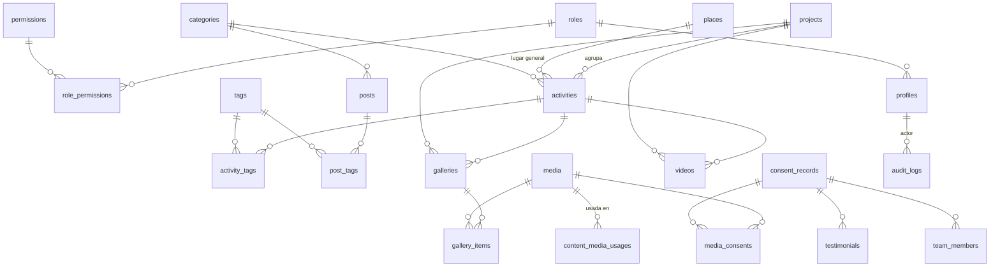

# 06 · Modelo de datos

> Versión 0.1 (borrador para aprobación) · 26-sep-2026
> Relacionado: `02-requisitos.md` · `04-arquitectura.md` · `05-seguridad.md` §5
> Decisiones aprobadas: tablas por tipo de contenido · `places` como catálogo · `consent_records` mínimo · roles/permisos en tablas.

Este documento describe **qué** se guarda y **quién** puede verlo o cambiarlo. El SQL real vivirá en `supabase/migrations/`; aquí se usa pseudo-SQL para explicar.

---

## 1. Convenciones

| Tema | Regla |
|---|---|
| Nombres | Tablas en plural `snake_case` en inglés (`activities`); columnas `snake_case` |
| Claves primarias | `id uuid default gen_random_uuid()` (no revela cuántos registros hay ni su orden). Catálogos del sistema: `smallint`/`text` |
| Fechas | `timestamptz` (se guarda en UTC y se muestra en America/Bogota). Fechas sin hora (`date`) solo donde la hora no importa |
| Texto enriquecido | `body jsonb` (documento Tiptap) + `body_text text` (texto plano extraído por la app, para búsqueda y extractos) |
| Estados fijos | Tipo `enum` solo para `content_status` (muy estable). Los demás, `text` + `check` (más fácil de ampliar con una migración) |
| Borrado | Lógico con `deleted_at`. El borrado físico solo lo hace un Administrador desde la papelera |
| Integridad | Toda relación con `foreign key`; toda FK con índice; reglas de negocio con `check` o triggers — no solo en la app (RNF-016 del .docx) |

### 1.1 Columnas comunes de las tablas de contenido

`activities`, `posts`, `projects`, `galleries`, `videos`, `testimonials`, `team_members` y `pages` comparten:

| Columna | Tipo | Notas |
|---|---|---|
| `id` | `uuid` PK | |
| `slug` | `text` | Solo en contenido con página propia. Único entre no borrados. Formato `^[a-z0-9]+(-[a-z0-9]+)*$` |
| `status` | `content_status` | `draft` · `review` · `published` · `archived`. Por defecto `draft` |
| `published_at` | `timestamptz` | Obligatorio si `status = 'published'` |
| `seo_title` · `seo_description` | `text` | Opcionales; si faltan se usan título y resumen |
| `cover_media_id` | `uuid` FK → `media` | Imagen principal / Open Graph |
| `created_at` · `updated_at` | `timestamptz` | Los llena un trigger |
| `created_by` · `updated_by` | `uuid` FK → `profiles` | Los llena un trigger con `auth.uid()` (no el formulario) |
| `deleted_at` | `timestamptz` | `null` = activo |

> **¿Y el estado "programado"?** No es un valor guardado: es `status = 'published'` con `published_at` en el futuro. El panel lo muestra como "Programado" y el sitio lo oculta hasta que llegue la hora (ver `04-arquitectura.md` §5.2). Así no se necesita una tarea que cambie estados.

## 2. Diagrama entidad-relación



Tablas sin relaciones relevantes para el diagrama: `pages`, `site_settings`, `contact_messages`.

## 3. Acceso y usuarios

### `roles`
| Columna | Tipo | Notas |
|---|---|---|
| `id` | `smallint` PK identity | |
| `key` | `text` unique | `admin` · `editor` · `author` |
| `name` · `description` | `text` | Para mostrar en el panel |

### `permissions`
| Columna | Tipo | Notas |
|---|---|---|
| `key` | `text` PK | Formato `modulo.accion` |
| `description` | `text` | |

### `role_permissions`
PK compuesta (`role_id`, `permission_key`).

Roles y permisos son **datos del sistema**: se cargan en una **migración** (no en el seed) y solo cambian con otra migración.

| Permiso | author | editor | admin |
|---|:-:|:-:|:-:|
| `content.read` (ver todo el contenido en el panel) | ✅ | ✅ | ✅ |
| `content.create` · `content.update_own` · `media.upload` | ✅ | ✅ | ✅ |
| `content.update_any` · `content.publish` · `content.delete` · `media.update` | | ✅ | ✅ |
| `consent.manage` · `messages.read` · `messages.manage` · `taxonomy.manage` | | ✅ | ✅ |
| `users.manage` · `settings.manage` · `audit.read` · `trash.restore` · `trash.purge` | | | ✅ |

### `profiles`
Un perfil por cada usuario de `auth.users` (que gestiona Supabase Auth: correo, contraseña, MFA).

| Columna | Tipo | Notas |
|---|---|---|
| `id` | `uuid` PK, FK → `auth.users` | |
| `full_name` | `text` not null | |
| `role_id` | `smallint` FK → `roles`, **nullable** | `null` = sin permisos |
| `is_active` | `boolean` default `true` | Desactivar = sin acceso, sin borrar |
| `invited_by` | `uuid` FK → `profiles` | |
| `created_at` · `updated_at` | `timestamptz` | |

- Un trigger crea el perfil cuando se invita a alguien. El rol se toma de `raw_app_meta_data` (solo lo puede escribir el servidor con la clave secreta). **Nunca** de `raw_user_meta_data`, que el propio usuario puede modificar.
- Un usuario puede cambiar su `full_name`; `role_id` e `is_active` solo con `users.manage` (lo vigila un trigger).

### Funciones de apoyo (usadas por RLS y triggers)

```sql
-- ¿El usuario actual tiene este permiso? (activo + rol + permiso)
has_permission(p text) returns boolean   -- security definer, stable, search_path = ''

-- ¿La sesión actual completó MFA?
is_aal2() returns boolean                 -- (auth.jwt() ->> 'aal') = 'aal2'
```

## 4. Clasificación

### `categories`
| Columna | Tipo | Notas |
|---|---|---|
| `id` | `uuid` PK | |
| `scope` | `text` check (`activity`, `post`) | Cada tipo de contenido tiene sus categorías |
| `name` · `slug` | `text` | Único por (`scope`, `slug`) |
| `description` | `text` | |
| `position` | `int` | Orden en menús y filtros |
| `created_at` · `updated_at` · `deleted_at` | | |

### `tags`
`id`, `name`, `slug` (único), `created_at`, `deleted_at`.
Tablas puente: `activity_tags` (`activity_id`, `tag_id`) y `post_tags` (`post_id`, `tag_id`).

### `places`
| Columna | Tipo | Notas |
|---|---|---|
| `id` | `uuid` PK | |
| `name` · `slug` | `text` | `slug` único |
| `kind` | `text` check (`municipality`, `neighborhood`, `vereda`, `sector`, `other`) | |
| `is_active` | `boolean` | |
| `created_at` · `updated_at` · `deleted_at` | | |

- Guarda **lugares generales** (barrio, vereda). **Nunca direcciones** (RN-A-03).
- **La lista la carga la organización** desde el panel; no se inventa.
- Etapa B: se agrega `parent_id` → FK a `places` para la jerarquía municipio → barrio/vereda → sector.

## 5. Contenido

Todas incluyen las **columnas comunes** (§1.1).

### `activities` — Actividades (RF-A-03)
| Columna | Tipo | Notas |
|---|---|---|
| `title` | `text` not null | ≤ 160 caracteres |
| `summary` | `text` | ≤ 300; se usa en tarjetas y SEO |
| `body` · `body_text` | `jsonb` · `text` | |
| `starts_at` | `timestamptz` not null | "Realizada" o "próxima" se **calcula** comparando con la fecha actual |
| `ends_at` | `timestamptz` | check `ends_at >= starts_at` |
| `place_id` | `uuid` FK → `places` | |
| `category_id` | `uuid` FK → `categories` (scope `activity`) | |
| `project_id` | `uuid` FK → `projects`, nullable | |
| `results` | `text` | Resultados reportados por la organización (sin cifras inventadas) |

Regla RN-A-02 como `check`: si `status = 'published'` → `place_id` y `category_id` no nulos.

### `posts` — Historias/Blog (RF-A-04)
| Columna | Tipo | Notas |
|---|---|---|
| `title` · `excerpt` | `text` | |
| `body` · `body_text` | `jsonb` · `text` | |
| `category_id` | `uuid` FK → `categories` (scope `post`) | |
| `author_id` | `uuid` FK → `profiles` | Quién la escribió (interno) |
| `byline` | `text` | Firma pública, editable (p. ej. el nombre de la autora o "Equipo Reconstruyendo Esperanza"). Evita exponer la tabla `profiles` al público |

### `projects` — Proyectos (RF-A-05)
| Columna | Tipo | Notas |
|---|---|---|
| `title` · `summary` · `objective` | `text` | |
| `body` · `body_text` | `jsonb` · `text` | |
| `project_status` | `text` check (`planned`, `active`, `paused`, `completed`) | Estado del proyecto (distinto del estado de publicación) |
| `start_date` · `end_date` | `date` | check `end_date >= start_date` |

### `galleries` y `gallery_items` — Galería (RF-A-06)
`galleries`: columnas comunes + `title`, `description`, `activity_id` (nullable), `project_id` (nullable).
`gallery_items`: PK (`gallery_id`, `media_id`), `position int`, `caption text`.

### `videos` — Videos (RF-A-07)
| Columna | Tipo | Notas |
|---|---|---|
| `title` · `description` | `text` | |
| `provider` | `text` check (`youtube`, `vimeo`, `facebook`, `tiktok`) | |
| `provider_video_id` | `text` not null | Se extrae de la URL en el servidor; **nunca** se guarda HTML/iframe |
| `activity_id` · `project_id` | `uuid` nullable | |

Único (`provider`, `provider_video_id`) entre no borrados.

### `testimonials` — Testimonios
Columnas comunes (sin `slug`) + `quote text`, `author_display_name text`, `author_context text` (descripción breve aprobada por la persona), `photo_media_id uuid`, **`consent_record_id uuid not null`**: no existe testimonio sin autorización.

### `team_members` — Equipo
Columnas comunes (sin `slug`) + `full_name`, `role_title`, `bio`, `photo_media_id`, `position int`, `consent_record_id uuid`.
Check: si `status = 'published'` → `consent_record_id` no nulo.

### `pages` — Páginas institucionales y legales
Columnas comunes + `key text unique` (`about`, `support`, `privacy-policy`, `privacy-notice`), `title`, `body`, `body_text`, `version text` (obligatorio en las legales: el formulario de contacto guarda qué versión aceptó la persona).

Contenido inicial: marcadores `[PENDIENTE: …]`, nunca texto que parezca real.

## 6. Medios y autorizaciones

### `media`
| Columna | Tipo | Notas |
|---|---|---|
| `id` | `uuid` PK | También es el nombre de archivo (UUID) |
| `processing_status` | `text` check (`processing`, `ready`, `failed`) | |
| `private_path` | `text` | Carpeta de las versiones procesadas en Storage privado |
| `public_key` | `text`, nullable | Prefijo en R2; **solo** existe mientras la imagen es pública |
| `mime_type` · `width` · `height` · `bytes` | | Del archivo procesado |
| `alt_text` | `text` | Obligatorio para publicar (RF-A-28) |
| `caption` · `credit` | `text` | |
| `people_in_photo` | `text` check (`none`, `identifiable`, `minors`), **nullable** | `null` = "sin clasificar" → **no se puede publicar** hasta que alguien lo defina |
| `uploaded_by` | `uuid` FK → `profiles` | |
| `created_at` · `updated_at` · `deleted_at` | | |

No se guarda el nombre original del archivo ni ningún metadato EXIF.

### `consent_records` — Autorizaciones de uso de imagen (RF-A-29)
| Columna | Tipo | Notas |
|---|---|---|
| `id` | `uuid` PK | |
| `subject_name` | `text` not null | Persona que aparece |
| `is_minor` | `boolean` not null | |
| `signer_type` | `text` check (`self`, `legal_guardian`) | |
| `signer_name` | `text` | Obligatorio si `legal_guardian` |
| `scope_description` | `text` not null | Qué cubre (p. ej. "fotos de la jornada del 12/03/2026") |
| `activity_id` | `uuid` FK nullable | |
| `granted_on` | `date` not null | |
| `channel` | `text` check (`paper`, `digital`) | |
| `form_version` | `text` not null | Versión del formato firmado |
| `document_path` | `text` not null | Escaneo/foto del formato firmado en bucket **privado** |
| `revoked_at` · `revocation_note` | | Revocación (RB-005) |
| `created_at` · `created_by` · `updated_at` · `updated_by` · `deleted_at` | | |

Checks: `is_minor → signer_type = 'legal_guardian'`; `signer_type = 'legal_guardian' → signer_name not null`.
**Sin** cédula, teléfono, dirección ni correo (minimización). Tiempo de conservación: se define en `09-privacidad-y-marco-legal.md`.

### `media_consents`
PK (`media_id`, `consent_record_id`). Una foto puede requerir varias autorizaciones (varias personas) y una autorización cubrir varias fotos.

### `content_media_usages`
Registra **dónde se usa cada imagen** (portada, galería o dentro del texto): `media_id`, `entity_type` (`activity`, `post`, …), `entity_id`, `usage` (`cover`, `body`, `gallery`, `photo`). La app lo actualiza al guardar.

Sirve para dos cosas:
1. **Bloquear la publicación** si alguna imagen usada no es publicable.
2. Si se **revoca** una autorización, saber qué contenidos quedan afectados y retirar la imagen de R2.

### Regla "¿esta imagen se puede publicar?"

```text
media_is_publishable(m) =
      m.alt_text no vacío
  AND m.people_in_photo no es null
  AND ( m.people_in_photo = 'none'
        OR existe una autorización vigente (no revocada, no borrada) vinculada
           y, si people_in_photo = 'minors', firmada por representante legal )
```

Un **trigger** en cada tabla de contenido la evalúa para todas sus imágenes cuando el estado pasa a `published`, y rechaza la operación indicando qué imagen falla (HU-06). Está en la base de datos, así que ni un error en la app puede saltársela.

> Nota: con varias personas en una foto, el sistema verifica que haya **al menos una** autorización vigente vinculada y la de representante legal si hay menores; confirmar que **todas** las personas están cubiertas es responsabilidad de quien vincula las autorizaciones (el panel lo recordará con un aviso).

## 7. Comunidad y sistema

### `contact_messages` (RF-A-09)
| Columna | Tipo | Notas |
|---|---|---|
| `id` | `uuid` PK | |
| `full_name` | `text` not null | |
| `email` · `phone` | `text` | check: al menos uno |
| `message` | `text` not null | ≤ 5.000 caracteres |
| `privacy_policy_version` | `text` not null | Qué versión aceptó |
| `consent_accepted_at` | `timestamptz` not null | |
| `status` | `text` check (`new`, `read`, `handled`, `archived`) | |
| `handled_by` · `handled_at` | | |
| `ip_hash` | `text` | HMAC de la IP con clave secreta: sirve para detectar abuso sin guardar la IP |
| `created_at` · `deleted_at` | | |

⚠️ **Sin política de inserción para anónimos.** Si existiera, un bot podría insertar directo contra la API de Supabase con la clave pública, **saltándose Turnstile y el rate limit**. La inserción la hace la Server Action (después de Turnstile + rate limit + Zod) con el cliente administrativo de `lib/supabase/admin.ts`, solo para esta operación.

### `site_settings` (RF-A-30)
Tabla de **una sola fila** (`id boolean primary key default true check (id)`):
`organization_name`, `tagline`, `contact_email`, `whatsapp_number`, `phone`, `social_links jsonb`, `default_seo jsonb`, `updated_at`, `updated_by`.
Los valores empiezan vacíos o como `[PENDIENTE]`.

### `audit_logs` (RF-A-32)
| Columna | Tipo | Notas |
|---|---|---|
| `id` | `bigint` identity PK | |
| `occurred_at` | `timestamptz` default `now()` | |
| `actor_id` | `uuid` | `auth.uid()`; null si fue el sistema |
| `action` | `text` | `insert` · `update` · `soft_delete` · `restore` · `publish` · `unpublish` · `purge` · `role_change` · … |
| `table_name` · `record_id` | `text` | |
| `old_data` · `new_data` | `jsonb` | |
| `changed_fields` | `text[]` | Para mostrar "qué cambió" rápido |

- Escrita por un trigger genérico `security definer` en todas las tablas de negocio.
- **Nadie** puede modificarla ni borrarla (sin políticas de `update`/`delete`, sin permisos de escritura directa).
- Eventos de inicio de sesión los registra Supabase Auth en sus propios logs.

## 8. Vistas y búsqueda

### `public_timeline` — página Memoria (RF-A-08)
Vista con `security_invoker = true` que une lo publicado:

| Columna | Origen |
|---|---|
| `entity_type` | `activity` / `post` / `project` |
| `id` · `title` · `slug` · `summary` · `cover_media_id` | De cada tabla |
| `event_date` | `starts_at` (actividad) · `published_at` (historia) · `start_date` (proyecto) |
| `year` | Año de `event_date` en America/Bogota |

Como respeta la RLS de quien consulta, un visitante solo ve lo publicado.

### Búsqueda (RF-A-12)
- Columna `search_vector tsvector` **generada** en `activities`, `posts` y `projects` a partir de título, resumen y `body_text`, con configuración `spanish` y sin tildes (función `unaccent` envuelta como `immutable`) → "jornada de salud" encuentra "Jornada de Salúd".
- Índice **GIN** sobre `search_vector`.

## 9. Índices

| Tabla | Índice | Para qué |
|---|---|---|
| Contenido (todas) | `unique (slug) where deleted_at is null` | URLs únicas sin chocar con borrados |
| Contenido (todas) | `(status, published_at desc) where deleted_at is null` | Listados públicos |
| `activities` | `(starts_at desc)` · `(place_id)` · `(category_id)` · `(project_id)` | Filtros y Memoria |
| `activities` · `posts` · `projects` | GIN `(search_vector)` | Búsqueda |
| Todas las FK | Índice en la columna FK | Joins y borrados rápidos (el asesor de Supabase lo exige) |
| `content_media_usages` | `(media_id)` · `(entity_type, entity_id)` | Verificar publicabilidad y revocaciones |
| `audit_logs` | `(occurred_at desc)` · `(table_name, record_id)` · `(actor_id, occurred_at desc)` | Filtros de auditoría |
| `contact_messages` | `(status, created_at desc)` | Bandeja |

## 10. Políticas RLS

Abreviaturas: **pub** = `status = 'published' and published_at <= now() and deleted_at is null` · **A2** = `is_aal2()` · **P(x)** = `has_permission('x')`.

| Tabla | SELECT | INSERT | UPDATE | DELETE (físico) |
|---|---|---|---|---|
| Contenido (`activities`, `posts`, `projects`, `galleries`, `videos`, `testimonials`, `team_members`, `pages`) | anon: **pub** · auth: A2 ∧ P(`content.read`) | A2 ∧ P(`content.create`) | A2 ∧ (P(`content.update_any`) ∨ (P(`content.update_own`) ∧ `created_by = auth.uid()` ∧ estado ∈ {draft, review})) | A2 ∧ P(`trash.purge`) ∧ `deleted_at is not null` |
| Tablas puente (`*_tags`, `gallery_items`) | Si el padre es visible | Como UPDATE del padre | — | Como UPDATE del padre |
| `categories` · `tags` · `places` | anon/auth: `deleted_at is null` | A2 ∧ P(`taxonomy.manage`) | A2 ∧ P(`taxonomy.manage`) | A2 ∧ P(`trash.purge`) |
| `media` | anon: `public_key is not null ∧ deleted_at is null` · auth: A2 ∧ P(`content.read`) | A2 ∧ P(`media.upload`) | A2 ∧ (P(`media.update`) ∨ `uploaded_by = auth.uid()`) | A2 ∧ P(`trash.purge`) |
| `consent_records` · `media_consents` | A2 ∧ P(`consent.manage`) | A2 ∧ P(`consent.manage`) | A2 ∧ P(`consent.manage`) | A2 ∧ P(`trash.purge`) |
| `content_media_usages` | auth: A2 ∧ P(`content.read`) | Con el contenido | Con el contenido | Con el contenido |
| `contact_messages` | A2 ∧ P(`messages.read`) | **Ninguna** (solo servidor, §7) | A2 ∧ P(`messages.manage`) | A2 ∧ P(`trash.purge`) |
| `site_settings` | anon/auth: sí | — | A2 ∧ P(`settings.manage`) | — |
| `profiles` | propio · o A2 ∧ P(`users.manage`) | Trigger de invitación | propio (`full_name`) · o A2 ∧ P(`users.manage`) | — (se desactiva) |
| `roles` · `permissions` · `role_permissions` | auth: sí | — (migraciones) | — | — |
| `audit_logs` | A2 ∧ P(`audit.read`) | Solo trigger | **Nunca** | **Nunca** |

**Lo que la RLS no puede ver y resuelven triggers** (`guard_content_changes`):
- Pasar a `published`/`archived` o salir de ellos exige `content.publish`.
- Cambiar `deleted_at` (enviar a papelera) exige `content.delete`; restaurar exige `trash.restore`.
- `created_by` no se puede cambiar.
- Transiciones de estado válidas según el diagrama de `04-arquitectura.md` §5.2.

**Pruebas pgTAP** (en `supabase/tests/`), como mínimo por tabla: anónimo no ve borradores ni programados; Autor no publica ni edita contenido ajeno; sesión sin `aal2` no escribe; nadie modifica `audit_logs`; anónimo no inserta en `contact_messages`; no se publica contenido con imagen sin autorización.

## 11. Almacenamiento de archivos

| Dónde | Bucket | Acceso | Contenido |
|---|---|---|---|
| Supabase Storage | `media-incoming` | Privado; subida solo con URL firmada (60 s) | Originales temporales; se borran al procesar |
| Supabase Storage | `media-private` | Privado; el panel ve con URL firmada | Versiones procesadas (sin EXIF/GPS) |
| Supabase Storage | `consent-documents` | Privado; solo `consent.manage` con URL firmada | Formatos de autorización firmados |
| Cloudflare R2 | `media-public` | Público de solo lectura | `media/{uuid}/{tamaño}.webp` de contenido publicado y autorizado |
| Cloudflare R2 | `backups` | Privado | Backups cifrados de la BD |

## 12. Orden de migraciones

| # | Migración | Contenido |
|---|---|---|
| 1 | `extensions_and_helpers` | `unaccent`, funciones de fechas, trigger `set_updated_at`, `set_actor_columns` |
| 2 | `access_control` | `roles`, `permissions`, `role_permissions`, `profiles`, `has_permission`, `is_aal2`, datos de roles/permisos |
| 3 | `audit` | `audit_logs` y trigger genérico |
| 4 | `taxonomy` | `categories`, `tags`, `places` |
| 5 | `media_and_consents` | `media`, `consent_records`, `media_consents`, `media_is_publishable` |
| 6 | `content` | Tablas de contenido, puentes, `content_media_usages`, `guard_content_changes`, trigger de publicabilidad |
| 7 | `site` | `pages`, `site_settings`, `contact_messages` |
| 8 | `views_and_search` | `public_timeline`, `search_vector`, índices GIN |
| 9 | `storage` | Buckets y políticas de Storage |

Cada migración llega con sus pruebas pgTAP en el mismo PR.

**Datos de desarrollo** (`supabase/seed.sql`, solo local): contenido marcado `[DEMO]`, usuarios de prueba y fotos genéricas sin personas. Nunca datos reales.

## 13. Evolución hacia la Etapa B

- `places.parent_id` para la jerarquía territorial.
- Datos de personas/beneficiarios en un **esquema separado** (`internal`) sin ningún permiso para `anon`, con sus propias políticas y retención — separados físicamente del contenido público (RB-008).
- Nuevos roles del .docx = filas nuevas en `roles`/`role_permissions` + permisos por territorio.
- `content_revisions` (historial de versiones, RF-A-34) si se prioriza.
