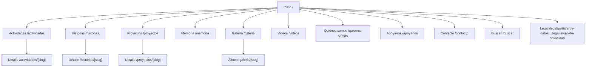

# 07 · Diseño UX/UI y SEO

> Versión 0.1 (borrador para aprobación) · 26-sep-2026
> Referencias: logo "Reconstruyendo Esperanza" (copia privada, fuera del repo) · plantilla Lovable *Broadsheet* (editorial) · `02-requisitos.md`

---

## 1. Principios de diseño

1. **Memoria antes que propaganda.** El protagonista es el trabajo con la comunidad: fechas, lugares, fotos, resultados. Nada de estética de campaña (retratos gigantes, eslóganes, cuentas regresivas, colores de partido).
2. **Dignidad de las personas.** Las fotos muestran a la comunidad como protagonista, no como "beneficiaria necesitada". Sin imágenes que expongan vulnerabilidad sin necesidad.
3. **Claro en un celular con datos móviles.** Se diseña primero para 360 px y 4G; el escritorio es la ampliación.
4. **Editorial y cálido.** Estructura de periódico (orden, jerarquía, fechas visibles) con la calidez del logo (verde, dorado, crema, hojas).
5. **Accesible para todos.** Letra legible, buen contraste, botones grandes; pensado también para personas mayores y con poca experiencia digital.

## 2. Qué tomamos de *Broadsheet* y qué no

| De la plantilla | Decisión | Por qué |
|---|---|---|
| Cabecera tipo periódico (masthead) con fecha | ✅ Adaptada: nombre en Fraunces + línea "Calarcá, Quindío · sábado, 26 de septiembre de 2026" | Refuerza "memoria" y actualidad |
| Letra gótica (blackletter) | ❌ | Se ve solemne/antigua; no conecta con esperanza ni con el logo |
| Paleta crema + naranja quemado | 🔄 Crema + **verde bosque** + **dorado** del logo | Identidad propia |
| Cuadrícula asimétrica, filetes (líneas) entre columnas | ✅ | Orden editorial, mucho contenido sin desorden |
| Fotos en gris → color al pasar el mouse | ✅ Solo escritorio y en listados | Metáfora de "reconstruir": lo gris recobra color. En celular (sin mouse) las fotos se ven a color |
| Secciones por categoría con diseños distintos | ✅ Actividades, Historias, Proyectos | Cada sección con su ritmo |
| Galería con carrusel | ✅ Con visor accesible (teclado, `alt`, sin autoplay) | RF-A-06 |
| Suscripción a boletín | ❌ Fuera de la Etapa A | Requiere manejo de datos y envíos masivos; se reemplaza por "Síguenos" + WhatsApp |
| Páginas de muestra de componentes | ❌ | No aportan al visitante |

## 3. Identidad visual

### 3.1 Logo

- ⚠️ **Pendiente:** versión del logo **sin la fotografía** (título + hojas + "Calarcá"), idealmente en **SVG** o PNG transparente, más una versión reducida (solo hojas o monograma) para favicon e ícono.
- Mientras llega: el nombre se escribe como texto en Fraunces (no se recorta ni se redibuja el logo).
- La foto de Angélica María Díaz se usa **solo** en "Quiénes somos" con su biografía autorizada, no en la cabecera.

### 3.2 Paleta de colores (tokens)

Derivada del logo. Contraste calculado sobre el fondo `paper` (WCAG AA exige ≥ 4,5 para texto normal y ≥ 3 para texto grande e íconos).

| Token | Hex | Uso | Contraste sobre `paper` |
|---|---|---|---|
| `paper` | `#F7F3EA` | Fondo general (crema) | — |
| `paper-2` | `#EFE8D8` | Bandas, tarjetas destacadas | — |
| `ink` | `#1C2420` | Texto principal | **14,3** ✅ |
| `ink-muted` | `#4F5A53` | Fechas, metadatos, pies de foto | **6,5** ✅ |
| `green-900` | `#173B26` | Pie de página, cabecera invertida | **11,2** ✅ |
| `green-700` | `#245C3A` | **Color principal**: enlaces, botones | **7,1** ✅ (texto crema sobre verde: 7,1 ✅) |
| `gold-500` | `#B79A4B` | **Solo decorativo**: filetes, hojas, subrayados | 2,5 ❌ para texto → nunca como texto sobre crema |
| `gold-700` | `#7A6224` | Etiquetas/"kicker" en dorado cuando sea texto | **5,3** ✅ |
| `rule` | `#D9D0BC` | Líneas divisorias y bordes | Decorativo |
| `danger` | `#A33A2A` | Errores | **5,9** ✅ |

- Sobre `green-900`, el dorado `gold-500` sí sirve para textos grandes (4,6).
- **Modo oscuro:** no en el sitio público de la Etapa A (identidad editorial en crema). El panel usa los temas de shadcn/ui y puede tenerlo.

### 3.3 Tipografía

| Uso | Fuente | Detalles |
|---|---|---|
| Nombre, titulares, citas | **Fraunces** (serif variable) | Pesos 600–700 en titulares; *italic* en citas destacadas |
| Texto, menús, formularios, panel | **Inter** | 400/500/600 |
| Letra manuscrita de "Esperanza" | Solo dentro del logo | No se usa como fuente web (poco legible en textos) |

Escala (móvil → escritorio): titular portada 36→64 px · H1 32→48 · H2 24→32 · H3 20→24 · texto 17→18 px (interlineado 1,6) · metadatos 14 px.
Texto de lectura con ancho máximo ~68 caracteres. Fuentes servidas con `next/font` (subconjunto latino, `display: swap`).

### 3.4 Retícula, espacios y elementos

- Retícula de 12 columnas en escritorio (≥ 1024 px), 6 en tablet, 1–2 en celular; márgenes laterales de 16 px en celular.
- Espaciado en múltiplos de 4 px.
- **Filetes** (`rule`, 1 px) entre columnas y secciones, al estilo periódico; filete dorado corto sobre titulares de sección.
- Esquinas casi rectas (radio 2–4 px): lenguaje editorial, no "app".
- Íconos **Lucide**, trazo 1,5–2 px, siempre con texto o `aria-label`.
- Hojas del logo como motivo decorativo sutil (separadores, estados vacíos), sin abusar.
- Animaciones cortas (150–250 ms) y desactivadas con `prefers-reduced-motion`.

### 3.5 Fotografía

- Formatos: portada 16:9 (y 1,91:1 para Open Graph), tarjetas 4:3, retratos del equipo 4:5.
- Siempre con texto alternativo descriptivo y, cuando aplique, pie de foto con lugar y fecha.
- Sin filtros que alteren la realidad; el efecto gris→color es solo de interacción.

## 4. Voz y tono

- Español de Colombia, cercano y respetuoso; frases cortas; verbos concretos ("entregamos", "acompañamos", "escuchamos").
- **Hechos verificables** en lugar de adjetivos: fecha, lugar, qué se hizo. Nada de cifras sin fuente.
- Sin lenguaje electoral ni comparaciones con otras personas o grupos.
- ⚠️ **Pendiente:** ¿"tú" o "usted" para dirigirse al visitante? (Ej.: "Escríbenos" vs. "Escríbanos").

## 5. Mapa del sitio



**Menú principal:** Actividades · Historias · Proyectos · Memoria · Galería · Quiénes somos · Contacto, y el botón destacado **Apóyanos**.
**Pie de página:** Videos, redes sociales, datos de contacto, páginas legales, "Hecho en Calarcá".
**Celular:** cabecera compacta con nombre + botón de menú (panel a pantalla completa con enlaces grandes) + botón flotante de WhatsApp (sin tapar contenido ni el botón de volver arriba).

## 6. Wireframes (baja fidelidad)

### 6.1 Inicio — escritorio

```
┌──────────────────────────────────────────────────────────────────────┐
│ Calarcá, Quindío · sábado, 26 de septiembre de 2026        🔍  Redes │
│══════════════════════════════════════════════════════════════════════│
│                    RECONSTRUYENDO ESPERANZA                           │
│══════════════════════════════════════════════════════════════════════│
│ Actividades  Historias  Proyectos  Memoria  Galería  Quiénes  [Apóyanos]│
├──────────────────────────────────────┬───────────────────────────────┤
│ [ FOTO DESTACADA 16:9 ]              │ PRÓXIMAS ACTIVIDADES           │
│ KICKER · categoría                   │ ─ 12 OCT · Lugar · Título      │
│ Titular grande en Fraunces           │ ─ 19 OCT · Lugar · Título      │
│ Resumen de dos líneas…               │ ─ 26 OCT · Lugar · Título      │
│ fecha · lugar                        │ [Ver todas →]                  │
├────────────┬────────────┬────────────┴───────────────────────────────┤
│ [foto 4:3] │ [foto 4:3] │ [foto 4:3]   ← ÚLTIMAS ACTIVIDADES           │
│ Título     │ Título     │ Título         (gris → color al pasar)      │
├────────────┴────────────┼──────────────────────────────────────────── ┤
│ HISTORIAS               │ PROYECTOS                                   │
│ ─ Título · extracto     │ [tarjeta] Estado: activo                    │
│ ─ Título · extracto     │ [tarjeta] Estado: en planeación             │
├─────────────────────────┴─────────────────────────────────────────────┤
│ MEMORIA  2026 ● ── 2025 ● ── 2024 ●   [Recorrer la memoria →]          │
├──────────────────────────────────────────────────────────────────────┤
│ ¿Quieres sumarte?  Voluntariado · Donaciones en especie  [Apóyanos]   │
└──────────────────────────────────────────────────────────────────────┘
```

### 6.2 Inicio — celular

```
┌──────────────────────┐
│ RECONSTRUYENDO    ☰  │
│ ESPERANZA            │
│ Calarcá · 26/09/2026 │
├──────────────────────┤
│ [ FOTO DESTACADA ]   │
│ KICKER               │
│ Titular              │
│ fecha · lugar        │
├──────────────────────┤
│ PRÓXIMAS             │
│ 12 OCT · Título    › │
│ 19 OCT · Título    › │
├──────────────────────┤
│ ÚLTIMAS ACTIVIDADES  │
│ [foto] Título        │
│ [foto] Título        │
├──────────────────────┤
│ HISTORIAS · PROYECTOS│
│ …                    │
│ [   Apóyanos   ]     │
│                  (🟢)│ ← WhatsApp flotante
└──────────────────────┘
```

### 6.3 Detalle de actividad

```
┌──────────────────────────────────────────────┬───────────────────┐
│ Inicio › Actividades › Título                │                   │
│ KICKER · categoría                           │ FICHA             │
│ Título de la actividad                       │ 📅 12/10/2026      │
│ Resumen                                      │ 📍 Barrio (general)│
│ [ FOTO PORTADA ]                             │ 🗂 Proyecto        │
│ Texto de la actividad…                       │ [Compartir: WA FB] │
│ ── Resultados ──                             ├───────────────────┤
│ Texto de resultados (reportado por la org.)  │ RELACIONADAS      │
│ ── Galería ── [▢][▢][▢][▢] (visor)           │ ─ Título          │
│ ── Video ── [ embed permitido ]              │ ─ Título          │
└──────────────────────────────────────────────┴───────────────────┘
```

### 6.4 Memoria

```
 FILTRAR:  [Todo ▾] [Actividades] [Historias] [Proyectos]    Año: [2026 ▾]
 ══ 2026 ═══════════════════════════════════════════════
  ● 12 OCT  [mini foto]  Título · lugar           Actividad
  │
  ● 28 SEP  [mini foto]  Título                    Historia
  │
 ══ 2025 ═══════════════════════════════════════════════
  ● …
```

### 6.5 Panel — publicar una actividad desde el celular (meta < 10 min, RNF-A-03)

```
 Paso 1/4 · Lo básico        Paso 2/4 · Fotos             Paso 3/4 · Personas en fotos
┌──────────────────────┐   ┌──────────────────────┐     ┌──────────────────────┐
│ Título  [_________]  │   │ [+ Tomar / elegir]   │     │ Foto 1  [miniatura]  │
│ Fecha   [12/10/2026] │   │ ▢ ▢ ▢ ▢  subiendo 3/8│     │ ¿Aparecen personas?  │
│ Lugar   [Barrio ▾]   │   │ Texto alternativo    │     │ (•) No  ( ) Sí       │
│ Categoría [▾]        │   │ de cada foto  [___]  │     │ ( ) Sí, con menores  │
│ Resumen [_________]  │   │ Portada: ★ foto 2    │     │ Autorización: [Vincular]│
│        [Siguiente →] │   │        [Siguiente →] │     │        [Siguiente →] │
└──────────────────────┘   └──────────────────────┘     └──────────────────────┘
 Paso 4/4 · Revisar y publicar
┌──────────────────────┐
│ ✅ Datos completos     │
│ ⚠️ Foto 4 sin autoriz.│ ← bloquea "Publicar", explica cómo resolver
│ [Guardar borrador]   │
│ [Enviar a revisión]  │ (Autor)
│ [Publicar ahora ▾]   │ (Editor/Admin: ahora · programar)
└──────────────────────┘
```

- Guardado automático del borrador (no se pierde el trabajo si se cae la señal).
- Subida en segundo plano con progreso por foto y reintento.
- Botones grandes (≥ 44 × 44 px), campos con el teclado correcto (fecha, teléfono).

### 6.6 Panel — estructura general

Escritorio: barra lateral (Dashboard · Contenido ▸ Actividades/Historias/Proyectos/Galerías/Videos/Testimonios/Equipo/Páginas · Medios · Autorizaciones · Mensajes · Categorías y lugares · Usuarios · Configuración · Auditoría · Papelera) y área de trabajo con tablas (TanStack Table) filtrables.
Celular: barra inferior con las 4 acciones frecuentes (Inicio · Nueva actividad · Mensajes · Más).
Estados siempre visibles con insignias: Borrador · En revisión · Programado · Publicado · Archivado.

## 7. Componentes principales

| Sitio público | Panel |
|---|---|
| `Masthead`, `MainNav`, `MobileMenu`, `Footer` | `AdminShell` (barra lateral / inferior) |
| `StoryCard` (variantes: destacada, 4:3, lista) | `DataTable` con filtros y acciones |
| `SectionHeader` (kicker + filete dorado) | `StatusBadge`, `PublishMenu` |
| `EventList` (próximas actividades) | `ContentForm` por pasos |
| `Timeline` (Memoria) | `RichTextEditor` (Tiptap) |
| `Gallery` + `Lightbox` accesible | `MediaUploader` (celular, progreso, reintento) |
| `VideoEmbed` (solo proveedores permitidos) | `PeopleInPhotoField` + `ConsentPicker` |
| `ShareButtons`, `WhatsAppButton` | `AuditTimeline` |
| `ContactForm` (Turnstile) | `EmptyState` con hojas del logo |
| `Breadcrumbs`, `Pagination` | `ConfirmDialog` para acciones irreversibles |

Base: **shadcn/ui** personalizado con los tokens de §3.

## 8. Accesibilidad (WCAG 2.2 AA)

- Contraste según §3.2; el foco del teclado siempre visible (contorno verde 2 px + separación).
- Enlace "Saltar al contenido"; encabezados en orden (un solo H1 por página); `lang="es-CO"`.
- Imágenes: `alt` obligatorio (el panel no deja publicar sin él); decorativas con `alt=""`.
- Formularios: etiqueta visible en cada campo, errores en texto (no solo color) y anunciados a lectores de pantalla.
- Objetivos táctiles ≥ 24 × 24 px (AA 2.2) y ≥ 44 × 44 px en acciones principales.
- Carrusel y visor: operables con teclado, sin movimiento automático, con botón de cerrar visible.
- Videos: sin reproducción automática.
- Verificación: axe (automático en Playwright) + prueba manual con teclado y lector de pantalla (TalkBack en Android) antes de lanzar.

## 9. SEO y difusión

| Tema | Implementación |
|---|---|
| URLs | En español, cortas y legibles: `/actividades/jornada-de-salud-la-huerta-2026` |
| Metadatos | `title` único por página (`Título · Reconstruyendo Esperanza`), `description` desde resumen o SEO manual, `canonical` |
| Open Graph / WhatsApp | Imagen 1200×630 desde la portada (o una imagen por defecto generada con el nombre y la paleta); `og:locale = es_CO` |
| Datos estructurados (JSON-LD) | `NGO`/`Organization` en todo el sitio · `Article` en historias · `Event` en actividades próximas y pasadas · `BreadcrumbList` |
| `sitemap.xml` | Generado desde la BD, solo contenido publicado; se actualiza al publicar |
| `robots.txt` | Permite el sitio público; bloquea `/admin` y `/buscar` |
| Panel | `noindex` en todo `/admin` |
| Rendimiento | Imágenes AVIF/WebP con tamaños correctos y `lazy` bajo el pliegue; LCP < 2,5 s |
| Presencia en Google | Alta en **Google Search Console** (envío del sitemap) y, si la organización tiene sede o punto de atención, **Perfil de Empresa de Google** — clave para aparecer primero al buscar el nombre (objetivo 1 del `01`) |
| Enlaces desde redes | El enlace del sitio en todas las biografías de redes oficiales |

## 10. Presupuesto de rendimiento

| Recurso | Límite (página pública, celular) |
|---|---|
| JavaScript inicial | ≤ 150 KB comprimido |
| Fuentes | ≤ 2 familias, subconjunto latino, ≤ 120 KB |
| Imagen LCP | ≤ 200 KB, con `priority` |
| Peso total primera carga | ≤ 1 MB |
| Lighthouse (4 categorías) | ≥ 90 |

## 11. Pendientes del cliente para esta fase

1. Logo sin foto (SVG/PNG transparente) y versión reducida para ícono.
2. ¿"Tú" o "usted"?
3. Fotos reales **con autorización** para la portada y secciones (mientras tanto: marcadores `[DEMO]` sin personas).
4. Biografía y foto oficial de Angélica María Díaz para "Quiénes somos".
5. Redes sociales oficiales y número de WhatsApp.
6. ¿Tiene sede o punto de atención físico (para el Perfil de Empresa de Google)?

## 12. Próximo entregable de diseño

Antes de programar las páginas: un **prototipo navegable de alta fidelidad** de Inicio (celular y escritorio) y del paso a paso del panel, con la paleta y tipografías reales, para validar con Victor y la organización.
