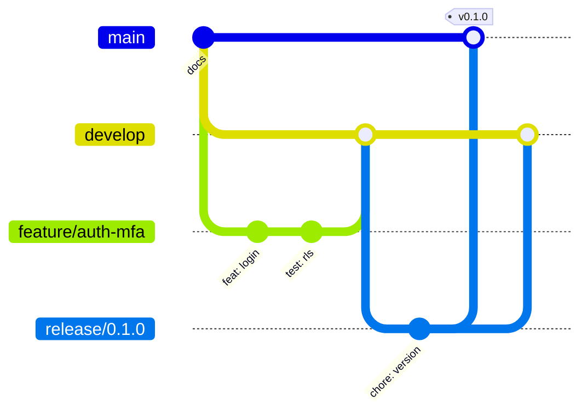

# 08 · Plan de fases, flujo de Git y Definition of Done

> Versión 0.1 (borrador para aprobación) · 26-sep-2026
> Regla del `CLAUDE.md`: **no se avanza a la siguiente fase sin que Victor apruebe la actual.**

---

## 1. Resumen de fases (Etapa A)

```mermaid
flowchart LR
    F0["F0 Análisis ✅"] --> F1["F1 Stack y arquitectura ✅"] --> F2["F2 Seguridad, datos y privacidad"] --> F3["F3 UX/UI"]
    F3 --> F4["F4 Base del proyecto"] --> F5["F5 Acceso y auditoría"] --> F6["F6 Medios y autorizaciones"]
    F6 --> F7["F7 Contenido y panel"] --> F8["F8 Sitio público"] --> F9["F9 Endurecimiento"] --> F10["F10 Lanzamiento"]
```



El tamaño es relativo (**S** pequeño · **M** medio · **L** grande): el proyecto lo construye una persona en tiempo parcial, así que no se fijan fechas hasta tener la velocidad real de las primeras fases de código.

| Fase | Objetivo | Entregables | Criterio de salida | Tamaño |
|---|---|---|---|:-:|
| **F0 · Análisis** ✅ | Entender el problema y acotar el MVP | `01`, `02` | Aprobados | S |
| **F1 · Stack y arquitectura** ✅ | Decidir cómo se construye | `03`, `04` | Aprobados | S |
| **F2 · Seguridad, datos y privacidad** | Diseñar protecciones y modelo antes de programar | `05`, `06`, `09` | Aprobados; `09` enviado a revisión legal | S |
| **F3 · UX/UI** | Validar la experiencia antes de programar páginas | `07` + prototipo de alta fidelidad (Inicio celular/escritorio + publicar actividad) | Aprobado por Victor y la organización | M |
| **F4 · Base del proyecto** | Proyecto funcionando "vacío" con calidad automática | Next.js + TS estricto + Tailwind + shadcn · Supabase local · estructura de carpetas · lint/typecheck/Vitest/Playwright · CI en GitHub Actions · Vercel preview · proyecto Supabase de staging · `.env.example` · comandos en `CLAUDE.md` | CI en verde; preview desplegado; README con instrucciones que funcionan en una máquina limpia | M |
| **F5 · Acceso y auditoría** | Entrar al panel de forma segura | Migraciones 1–3 · login + **MFA obligatorio** · invitaciones · perfiles/roles · `requireUser`/`requirePermission` · `proxy.ts` · rate limit de login · auditoría · layout del panel | HU-04 y HU-10 pasan; pgTAP en verde; `get_advisors` limpio | M |
| **F6 · Medios y autorizaciones** | Subir fotos seguras desde el celular | Migraciones 4–5 · subida directa + sharp + sin EXIF · R2 · biblioteca de medios · autorizaciones de imagen · categorías y lugares | HU-06 pasa; verificado que no hay GPS en imágenes procesadas | L |
| **F7 · Contenido y panel** | Crear y publicar todo el contenido | Migración 6 · CRUD de actividades, historias, proyectos, galerías, videos, testimonios, equipo · Tiptap · flujo editorial · programación · papelera · dashboard | HU-05, 07, 08, 09 pasan; publicar actividad con 10 fotos desde celular < 10 min | L |
| **F8 · Sitio público** | Lo que ve la comunidad | Migraciones 7–8 · todas las páginas públicas · Memoria · búsqueda · contacto con Turnstile · bandeja de mensajes · configuración del sitio · SEO/OG/sitemap/JSON-LD | HU-01, 02, 03, 11 pasan; Lighthouse ≥ 90 en staging | L |
| **F9 · Endurecimiento** | Dejarlo listo para el mundo real | Cabeceras y CSP · revisión de rate limits · backup cifrado + **restauración probada** · accesibilidad (axe + manual) · rendimiento · revisión de seguridad completa (`05` §15) · decisión final de hosting (`03` §5) | Checklist de producción (§5) completa salvo lo de lanzamiento | M |
| **F10 · Lanzamiento** | Publicar y transferir | Dominio · ambiente de producción · migraciones en prod (con aprobación) · carga de contenido real **con autorizaciones** · Search Console · monitor · capacitación y manual de uso | Sitio en producción; la organización publica sola una actividad | M |

**Después del lanzamiento:** periodo de estabilización (corrección de errores y ajustes de uso) → retrospectiva → decisión sobre la Etapa B.

### 1.1 Dependencias del cliente por fase

| Necesario para | Qué se necesita (ver `01` §6 y `07` §11) |
|---|---|
| F2 (`09`) | ¿Organización constituida con NIT o grupo informal? · responsable del tratamiento de datos · correo para consultas y reclamos |
| F3 | Logo sin foto · "tú" o "usted" · fotos de referencia |
| F8 | Textos de Quiénes somos, misión/visión, biografía autorizada · redes y WhatsApp · formas de apoyo · lista de lugares y categorías |
| F10 | Dominio elegido · actividades reales con fotos **y autorizaciones** · políticas legales revisadas por un abogado · 2 personas administradoras con celular para MFA |

Si falta algo, la fase avanza con marcadores `[PENDIENTE: …]`, pero **no se lanza** con marcadores visibles.

## 2. Forma de trabajo en cada paso

Tal como define el `CLAUDE.md`:

```
explicar qué → por qué → mostrar estructura → ESPERAR APROBACIÓN
→ implementar (módulo pequeño) → probar → revisar → commit (con confirmación) → siguiente
```

Siempre se pide confirmación explícita antes de: instalar paquetes, borrar/mover archivos, `commit`/`push`, aplicar migraciones en staging/producción.

## 3. Flujo de Git

### 3.1 Ramas



| Rama | Para qué | Se despliega en | Protección |
|---|---|---|---|
| `main` | Producción | Producción | Solo PR; CI en verde; sin force push ✅ (activa) |
| `develop` | Integración | Staging | Solo PR; CI en verde (se activa en F4) |
| `feature/*` | Una funcionalidad | Preview por PR | — |
| `fix/*` | Corrección en desarrollo | Preview por PR | — |
| `docs/*` | Solo documentación | — | — |
| `release/*` | Preparar versión | Staging | — |
| `hotfix/*` | Urgencia en producción (sale de `main`) | Producción | — |

- Mientras no exista código (F0–F3), la documentación se integra con PR de `docs/*` → `main`. En F4 se crea `develop` desde `main`.
- Merge a `develop` con **squash** (un commit limpio por funcionalidad); `release/*` → `main` con merge normal y **tag** de versión.
- Versiones: `v0.x.y` hasta el lanzamiento; `v1.0.0` = sitio en producción.

### 3.2 Commits

[Conventional Commits](https://www.conventionalcommits.org/) en inglés: `feat:`, `fix:`, `docs:`, `test:`, `refactor:`, `chore:`, `ci:`, `perf:`. Un commit = un cambio con sentido; mensaje en imperativo (`feat: add MFA enrollment screen`).

### 3.3 Pull requests

Cada PR incluye (plantilla en `.github/pull_request_template.md`, se crea en F4):
- Qué cambia y por qué; requisito/HU relacionado.
- Cómo se probó (y capturas si hay cambios visuales, celular y escritorio).
- Checklist: migración con RLS + pgTAP · documentación actualizada · sin secretos · accesibilidad revisada.

### 3.4 CI (GitHub Actions, se construye en F4)

| Verificación | Cuándo |
|---|---|
| `npm ci` + `lint` + `typecheck` | Cada PR |
| Pruebas unitarias (Vitest) | Cada PR |
| Pruebas RLS (pgTAP con Supabase en CI) | Cada PR que toque `supabase/` |
| `next build` | Cada PR |
| `npm audit` (altas/críticas bloquean) | Cada PR + semanal |
| E2E (Playwright) contra el preview | PR a `develop`/`main` |
| Backup nocturno | Programado (F9) |

## 4. Definition of Done (DoD)

Una funcionalidad está **terminada** solo si:

- [ ] Cumple los criterios de aceptación de su HU en `02-requisitos.md`.
- [ ] Funciona en celular (360 px) y escritorio; probada en Chrome Android y un navegador de escritorio.
- [ ] Toda Server Action sigue la secuencia usuario → MFA → permiso → Zod → rate limit.
- [ ] Tablas nuevas con **RLS + pruebas pgTAP**; `get_advisors` sin alertas nuevas.
- [ ] Pruebas unitarias de la lógica nueva; E2E si es un flujo crítico.
- [ ] Accesibilidad: teclado, foco visible, etiquetas, `alt`, contraste; axe sin errores.
- [ ] Sin textos inventados: contenido real o marcadores `[PENDIENTE]`/`[DEMO]`.
- [ ] Sin secretos ni datos personales en el código, logs o capturas.
- [ ] Documentación afectada actualizada en el **mismo PR**.
- [ ] CI en verde, PR revisado y aprobado por Victor.

## 5. Checklist de producción (antes de F10)

**Seguridad** → toda la lista de `05-seguridad.md` §15.

**Infraestructura**
- [ ] Decisión de hosting cerrada (`03` §5) y documentada
- [ ] Dominio a nombre de la organización; DNS en Cloudflare; HTTPS activo
- [ ] Revisar qué direcciones quedan públicas: *Standard Protection* de Vercel no cubre dominios de producción (`04` §8.1)
- [ ] Proyecto Supabase de producción separado de staging, en la organización de la iniciativa; migraciones aplicadas con aprobación
- [ ] La organización de Supabase tiene ≥ 2 *Owners* de la iniciativa, todos con MFA
- [ ] Variables de entorno de producción cargadas (nunca copiadas de staging)
- [ ] Correo: dominio verificado en Resend (SPF, DKIM, DMARC); correos de invitación y recuperación probados
- [ ] Monitor de disponibilidad con alerta
- [ ] Backup nocturno funcionando + restauración probada

**Contenido y legal**
- [ ] Política de tratamiento de datos y aviso de privacidad **revisados por un abogado** y publicados
- [ ] Ningún marcador `[PENDIENTE]` o `[DEMO]` visible (búsqueda automática en el build)
- [ ] Todas las fotos con personas tienen autorización registrada
- [ ] Textos institucionales aprobados por la organización

**Calidad**
- [ ] Lighthouse ≥ 90 (4 categorías) en Inicio, listado y detalle
- [ ] Vista previa correcta al compartir por WhatsApp y Facebook
- [ ] Páginas 404/500, favicon e íconos
- [ ] E2E completos en verde contra staging

**Operación**
- [ ] ≥ 2 Administradores con MFA configurado
- [ ] Manual de uso breve (con capturas) para el equipo de la organización
- [ ] Sesión de capacitación: publicar una actividad desde el celular
- [ ] Contactos de emergencia y accesos documentados en lugar privado
- [ ] Search Console configurado y sitemap enviado

## 6. Después del lanzamiento

| Frecuencia | Tarea |
|---|---|
| Semanal | Revisar alertas de Dependabot, errores y mensajes sin atender |
| Mensual | Actualizar dependencias (PR propio); revisar auditoría de accesos |
| Trimestral | **Probar restauración de backup**; revisar usuarios activos y permisos; rotar claves sensibles |
| Anual | Renovar dominio; revisar políticas legales y formatos de autorización |
